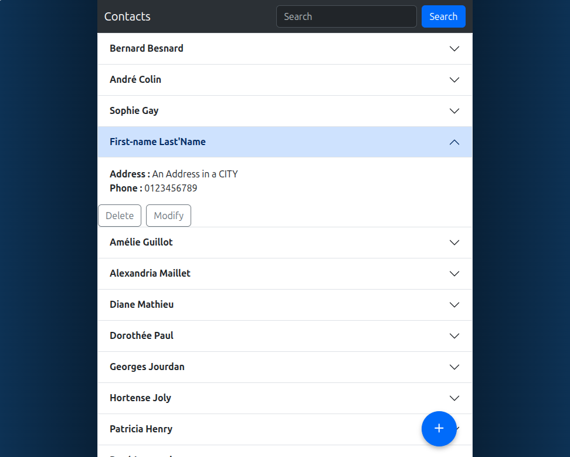
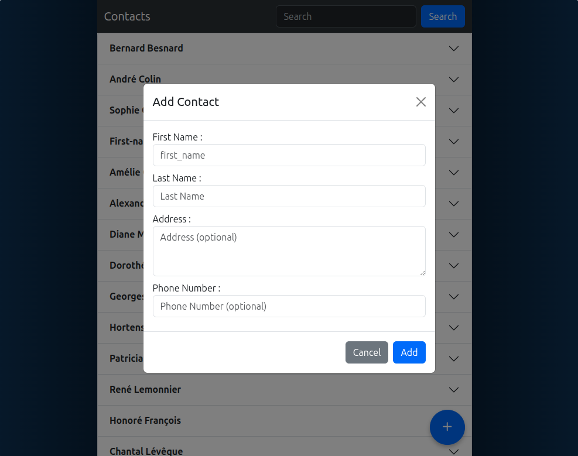
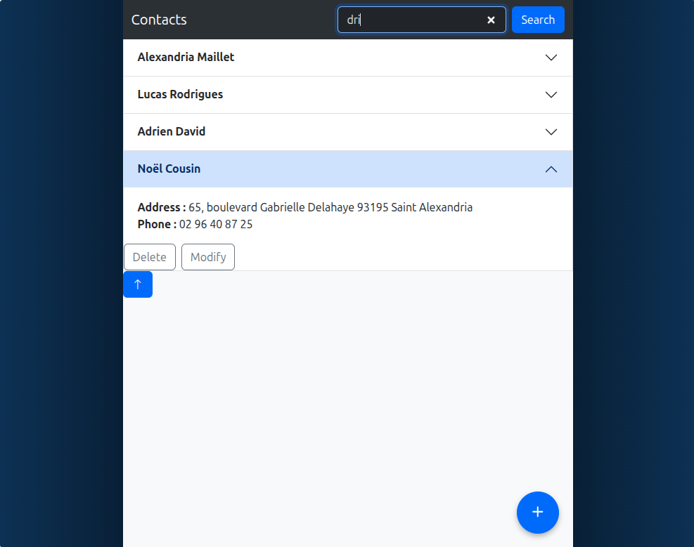

# CRM Contacts

Lightweight CRM built with Python, Django and TinyDB.

## Features

- **Full CRUD**: Add, edit, delete contacts
- **Real-time search**: Instant filtering by name, address or phone
- **Validation**: Names (letters, spaces, hyphens, apostrophes) and French phone numbers only
- **Responsive UI**: Bootstrap 5 with dark theme

## Tech Stack

| Component | Technology |
|-----------|------------|
| Backend | Python 3 / Django |
| Database | TinyDB (JSON) |
| Frontend | HTML5 / Bootstrap 5 |
| JavaScript | Vanilla JS (modal, search) |

## Project Structure

```
├── api/
│   ├── crm.py           # User model + business logic
│   ├── test_crm.py      # Unit tests
│   └── tinydb.json      # JSON database
├── contacts/
│   ├── views.py         # Django views (CRUD)
│   ├── urls.py          # Routes
│   └── templates/
│       └── index.html   # Main template
└── static/
    ├── css/style.css
    └── js/
        ├── modal.js     # Add/edit modal handling
        └── search.js    # Real-time search
```

## Installation

```bash
# Clone and create environment
git clone <repo>
cd crm
python -m venv venv
source venv/bin/activate  # Windows: venv\Scripts\activate

# Dependencies
pip install django tinydb

# Run
python manage.py runserver
```

## User Model API

```python
from api.crm import User, get_all_users

# Create
user = User("Jean", "Dupont", "06 12 34 56 78", "Paris")
user.save()

# Read
users = get_all_users()

# Update
user.phone_number = "07 00 00 00 00"
user.save()

# Delete
user.delete()
```

## Accepted Phone Formats

```
01 23 45 67 89
01.23.45.67.89
0123456789
+33 1 23 45 67 89
+33 (0)1 23 45 67 89
+33-123-456-789
```

## Tests

```bash
python -m unittest test_crm -v
```

## Routes

| Method | URL | Action |
|--------|-----|--------|
| GET | `/` | List contacts |
| POST | `/add/` | Add contact |
| POST | `/modify/<contact_id>/` | Edit contact |
| POST | `/delete/<contact_id>/` | Delete contact |

## Screenshots

### Main screen


### Modal screen


### Real-Time Search screen


## License

MIT - [DevCTx](LICENSE.txt)
